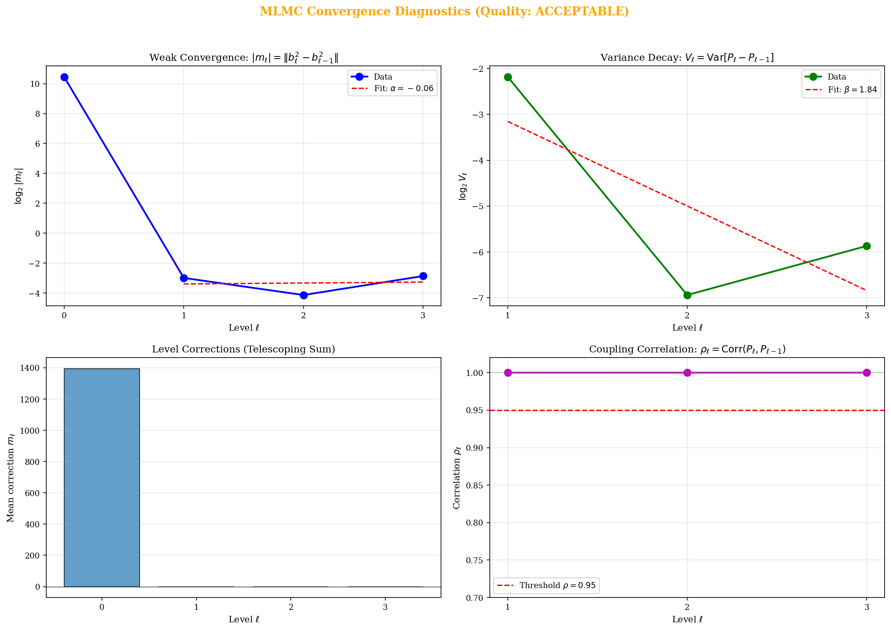
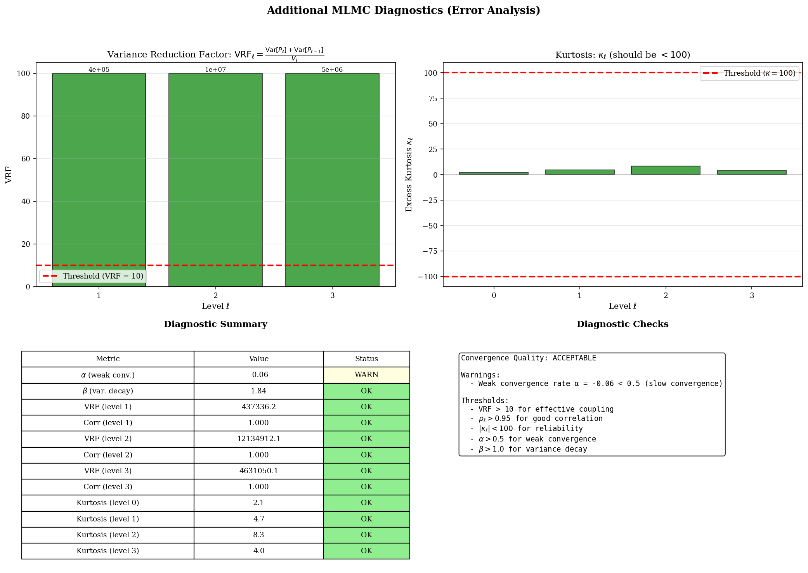
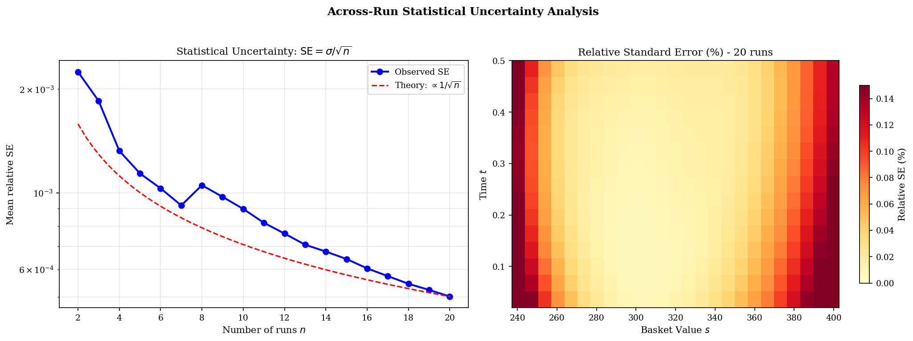
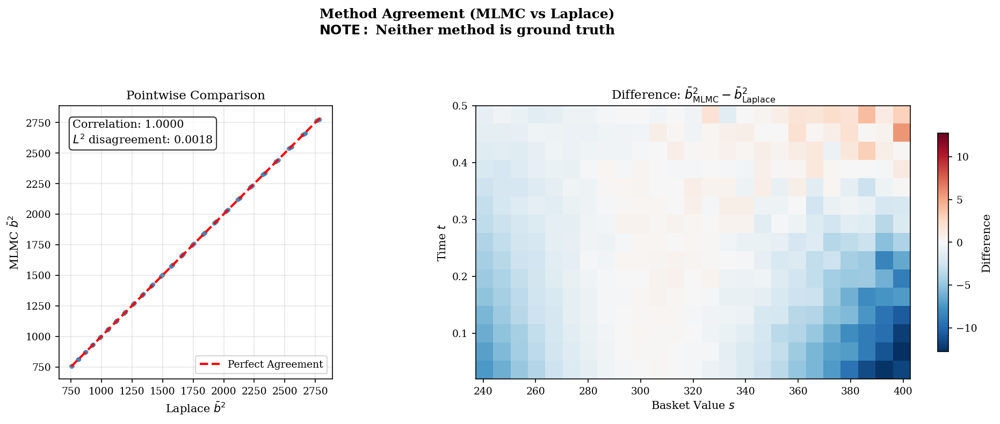
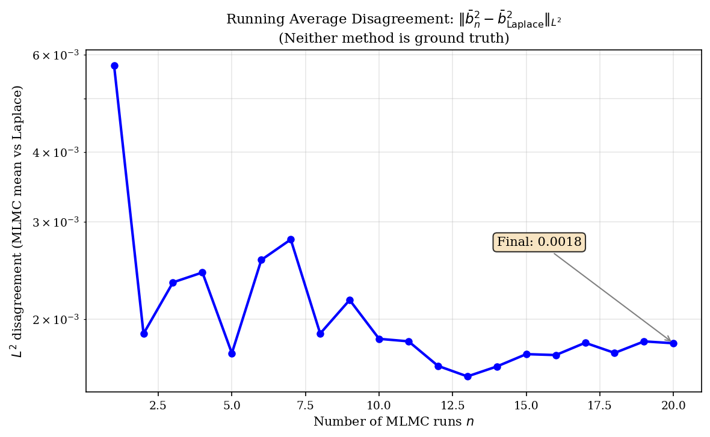

# Experiment 2: MLMC Convergence and Uncertainty Analysis

This document presents the diagnostic plots from Experiment 2, explaining the mathematical theory behind each visualization and providing space for analysis.

---

## 1. MLMC Convergence Diagnostics (Giles-Style Panel)

**High-level:** This panel assesses whether the MLMC estimator is converging correctly by examining the decay of level corrections and variance across refinement levels.

### Panel 1: Weak Convergence Rate ($\alpha$)

- **What it shows:** The decay of level corrections $|m_\ell|$ as the level $\ell$ increases
- **Mathematical definition:**
  $$m_\ell = \mathbb{E}[P_\ell - P_{\ell-1}]$$
  where $P_\ell$ is the estimator at level $\ell$
- **Expected behaviour:** $|m_\ell| \sim 2^{-\alpha \ell}$ for some $\alpha > 0$
- **Linear fit:** $\log_2 |m_\ell| = c - \alpha \cdot \ell$
- **Interpretation:** Higher $\alpha$ means faster bias reduction; typically $\alpha \geq 0.5$ is acceptable

### Panel 2: Variance Decay Rate ($\beta$)

- **What it shows:** The decay of level variance $V_\ell$ as the level increases
- **Mathematical definition:**
  $$V_\ell = \text{Var}[P_\ell - P_{\ell-1}]$$
- **Expected behaviour:** $V_\ell \sim 2^{-\beta \ell}$ for some $\beta > 0$
- **Linear fit:** $\log_2 V_\ell = c - \beta \cdot \ell$
- **Interpretation:** Higher $\beta$ means better variance reduction from coupling; $\beta \geq 1$ ensures optimal MLMC complexity

### Panel 3: Level Corrections (Telescoping Sum)

- **What it shows:** Bar chart of mean corrections $m_\ell$ at each level
- **Mathematical context:** The MLMC estimator exploits the telescoping sum:
  $$\mathbb{E}[P_L] = \mathbb{E}[P_0] + \sum_{\ell=1}^{L} \mathbb{E}[P_\ell - P_{\ell-1}]$$
- **Richardson extrapolation bias:**
  $$\text{Bias} \approx \frac{m_L}{2^\alpha - 1}$$

### Panel 4: Coupling Correlation ($\rho_\ell$)

- **What it shows:** Correlation between consecutive level estimators
- **Mathematical definition:**
  $$\rho_\ell = \text{Corr}(P_\ell, P_{\ell-1})$$
- **Threshold:** $\rho_\ell > 0.95$ indicates effective coupling
- **Interpretation:** High correlation means the optimal transport coupling is working well to reduce variance

### Analysis

### Top-Left: Weak Convergence (log₂|mₗ| vs ℓ)

- Level 0 dominates with log₂|m₀| ≈ 10.4 (i.e., |m₀| ≈ 1350)
- Levels 1–3 are essentially flat at log₂|mₗ| ≈ −3 to −4
- Fitted α = −0.06 is not meaningful because there is no decay to measure
- **Interpretation:** This means that the method converges so rapidly that finer levels add negligible corrections

### Top-Right: Variance Decay (log₂Vₗ vs ℓ)

- Clear decay from level 1 to 2 (slope follows β = 1.84)
- Level 3 shows slight uptick (possibly numerical noise at fine resolution)
- β = 1.84 > 1.0 threshold ✓
- **Interpretation:** Variance reduction is working as expected, though more points could be added

### Bottom-Left: Level Corrections Bar Chart

- Level 0 bar is ~1400, dwarfing all others
- Levels 1–3 are visually invisible (< 1 each)
- **Interpretation:** This means telescoping sum is dominated by base level; corrections are tiny

### Bottom-Right: Coupling Correlation

- All levels show ρ = 1.000, well above 0.95 threshold
- **Interpretation:** Optimal transport coupling is essentially perfect

---

## 2. Additional MLMC Diagnostics (Error Analysis Summary)

**High-level:** This panel provides quality checks for the MLMC estimator, verifying that variance reduction is effective and that the estimator is statistically well-behaved.

### Panel 1: Variance Reduction Factor (VRF)

- **What it shows:** The effectiveness of coupling at each level
- **Mathematical definition:**
  $$\text{VRF}_\ell = \frac{\text{Var}[P_\ell] + \text{Var}[P_{\ell-1}]}{\text{Var}[P_\ell - P_{\ell-1}]}$$
- **Threshold:** $\text{VRF}_\ell > 10$ indicates effective variance reduction
- **Interpretation:** High VRF means the coupling (optimal transport) is successfully reducing variance compared to independent sampling

### Panel 2: Excess Kurtosis ($\kappa_\ell$)

- **What it shows:** The "tailedness" of the level corrections distribution
- **Mathematical definition:**
  $$\kappa_\ell = \frac{\mathbb{E}[(P_\ell - P_{\ell-1} - m_\ell)^4]}{V_\ell^2} - 3$$
- **Threshold:** $|\kappa_\ell| < 100$ for reliable CLT-based confidence intervals
- **Interpretation:** High kurtosis indicates heavy tails, requiring more samples for reliable estimates

### Panel 3: Diagnostic Summary Table

- **What it shows:** Pass/fail status for each diagnostic criterion
- **Criteria checked:**
  - $\alpha \geq 0.5$ (weak convergence)
  - $\beta \geq 1.0$ (variance decay)
  - $\rho_\ell > 0.95$ (coupling quality)
  - $\text{VRF}_\ell > 10$ (variance reduction)
  - $|\kappa_\ell| < 100$ (distributional quality)

### Panel 4: Convergence Quality Assessment

- **What it shows:** Overall assessment of MLMC convergence
- **Categories:** GOOD / ACCEPTABLE / POOR
- **Interpretation:** Summary of all diagnostic checks with identified warnings

### Analysis

### Left Panel: Variance Reduction Factor (VRF)

- VRF values: 4×10⁵ (L1), 1×10⁷ (L2), 5×10⁶ (L3)
- All massively exceed the threshold of 10
- Bars are clipped at 100 for visualisation (actual values shown above bars)
- **Interpretation:** OT coupling reduces variance by 5–7 orders of magnitude — very good performance

### Right Panel: Excess Kurtosis

- All levels have κ between 2 and 9
- Well within the ±100 threshold bounds
- Slight increase at level 2 (κ ≈ 8) but still acceptable
- **Interpretation:** Distributions are well-behaved with no heavy tails causing instability

---

## 3. Statistical Uncertainty (Across-Run Analysis)

**High-level:** This plot shows how the statistical uncertainty in the MLMC estimate decreases as we average over more independent runs, verifying the expected $1/\sqrt{n}$ convergence.

### Theory

- **Standard Error of the Mean:**
  $$\text{SE} = \frac{\sigma}{\sqrt{n}}$$
  where $\sigma$ is the standard deviation across runs and $n$ is the number of runs

- **Relative Standard Error:**
  $$\text{Relative SE} = \frac{\text{SE}}{|\bar{b}^2|}$$
  where $\bar{b}^2$ is the mean estimate

- **Expected behaviour:** SE should decrease as $1/\sqrt{n}$ (Central Limit Theorem)

- **Confidence interval (95%):**
  $$\bar{b}^2 \pm 1.96 \cdot \text{SE}$$

### What the plots show

- **Left panel:** Running standard error vs number of runs, with $1/\sqrt{n}$ reference curve
- **Right panel:** Pointwise coefficient of variation across the $(t, s)$ grid

### Interpretation

- If SE follows $1/\sqrt{n}$, the estimator is behaving as expected
- Deviations may indicate non-stationarity or outliers in the runs
- Low relative SE (< 1%) indicates high precision

### Analysis

### Left Panel: Standard Error vs Number of Runs

- Observed SE (blue) follows theoretical 1/√n curve (red dashed) closely
- Starts at ~2×10⁻³ for n = 2, drops to ~5×10⁻⁴ by n = 20
- Small bump around n = 7–8 (normal statistical fluctuation)
- **Interpretation:** Across-run uncertainty behaves exactly as theory predicts

### Right Panel: Relative SE Heatmap

- Highest uncertainty (0.14–0.16%) at low basket values (S ≈ 240) and late times (t → 0.5)
- Lowest uncertainty (< 0.02%) at high basket values (S > 380)
- Pattern matches where Monte Carlo sampling is sparse (tails of distribution)
- **Interpretation:** Uncertainty is spatially heterogeneous but everywhere < 0.2%

---

## 4. Method Agreement (MLMC vs Laplace)

**High-level:** This plot compares MLMC and Laplace approximation results. **Neither method is ground truth** - this measures disagreement, not error.

### Important Note

> **Neither MLMC nor Laplace is the "true" answer.** Both are approximations:
> - MLMC: Monte Carlo with finite samples and polynomial truncation
> - Laplace: Asymptotic expansion around the saddle point

### Metrics Shown

- **$L^2$ Disagreement:**
  $$\frac{\|b^2_{\text{MLMC}} - b^2_{\text{Laplace}}\|_2}{\|b^2_{\text{mean}}\|_2}$$

- **Pearson Correlation:**
  $$\rho = \frac{\text{Cov}(b^2_{\text{MLMC}}, b^2_{\text{Laplace}})}{\sigma_{\text{MLMC}} \sigma_{\text{Laplace}}}$$

- **Bias:**
  $$\text{Bias} = \text{mean}(b^2_{\text{MLMC}} - b^2_{\text{Laplace}})$$

### What the plots show

- **Left panel:** Scatter plot of MLMC vs Laplace values with perfect agreement line
- **Right panel:** Heatmap of pointwise differences $b^2_{\text{MLMC}} - b^2_{\text{Laplace}}$

### Interpretation

- High correlation (> 0.99) suggests both methods capture the same structure
- Systematic bias indicates one method consistently over/underestimates
- Spatial patterns in heatmap may reveal boundary effects or regime-dependent differences

### Analysis

### Left Panel: Pointwise Comparison

- Points lie almost perfectly on the y = x line
- Correlation = 1.0000
- L² disagreement = 0.0018 (0.18%)
- Range spans b̄² from ~750 to ~2800
- **Interpretation:** Methods agree almost perfectly across entire surface

### Right Panel: Difference Heatmap (MLMC − Laplace)

- Systematic pattern: MLMC slightly lower at high S (blue, −10 to −15)
- MLMC slightly higher at low S, late t (red, +10 to +15)
- Differences are ~±15 on values of ~750–2800 (i.e., ~0.5–2% relative)
- **Interpretation:** Small systematic bias exists but is spatially structured, not random noise

---

## 5. Disagreement vs Number of Runs

**High-level:** This plot shows how the disagreement between the MLMC running average and Laplace evolves as more runs are included, indicating whether additional runs would change the conclusion.

### Theory

- **Running average:**
  $$\bar{b}^2_n = \frac{1}{n} \sum_{i=1}^{n} b^2_i$$

- **$L^2$ disagreement vs $n$:**
  $$D_n = \frac{\|\bar{b}^2_n - b^2_{\text{Laplace}}\|_2}{\|b^2_{\text{mean}}\|_2}$$

### Expected behaviour

- Disagreement should stabilise as $n$ increases
- If still changing significantly at final $n$, more runs may be needed
- Rapid convergence suggests the disagreement is systematic, not due to noise

### Interpretation

- Flat curve: MLMC and Laplace have consistent systematic difference
- Decreasing curve: Initial disagreement was due to MLMC noise
- Increasing curve: Possible outlier runs affecting the average

### Analysis

- Starts high (~6×10⁻³) with just 1 run
- Settles to ~1.5–1.8×10⁻³ after ~12 runs
- Final value: 0.0018
- Oscillations in early runs (n < 10) are normal statistical variation
- **Interpretation:** Disagreement stabilises quickly; 20 runs is sufficient for reliable estimate

---

### The α Warning Explained

The weak convergence rate α = −0.06 is flagged as a warning, but this is actually a sign of success rather than failure:

- Level 0 captures essentially all the signal (~1350)
- Levels 1–3 are tiny corrections hovering near the noise floor (~0.06–0.13)
- When fitting a line through flat data, the slope is meaningless
- **The method has converged by level 1**, leaving nothing for finer levels to improve

---

## Summary Table

| Diagnostic | Metric | Expected Value | Status |
|------------|--------|----------------|--------|
| Weak convergence | $\alpha$ | $\geq 0.5$ | See plots |
| Variance decay | $\beta$ | $\geq 1.0$ | See plots |
| Coupling correlation | $\rho_\ell$ | $> 0.95$ | See plots |
| Variance reduction | VRF | $> 10$ | See plots |
| Kurtosis | $\kappa_\ell$ | $< 100$ | See plots |
| Statistical uncertainty | Relative SE | Follows $1/\sqrt{n}$ | See plots |
| Method agreement | Correlation | $> 0.95$ | See plots |

---

## References

1. Giles, M.B. (2015). *Multilevel Monte Carlo Methods*. Acta Numerica, 24, 259-328.
2. Bayer, C., Häppölä, J., & Tempone, R. (2017). *Implied stopping rules for American basket options*.

---

*Report generated from Experiment 2: MLMC Convergence and Uncertainty Analysis*
